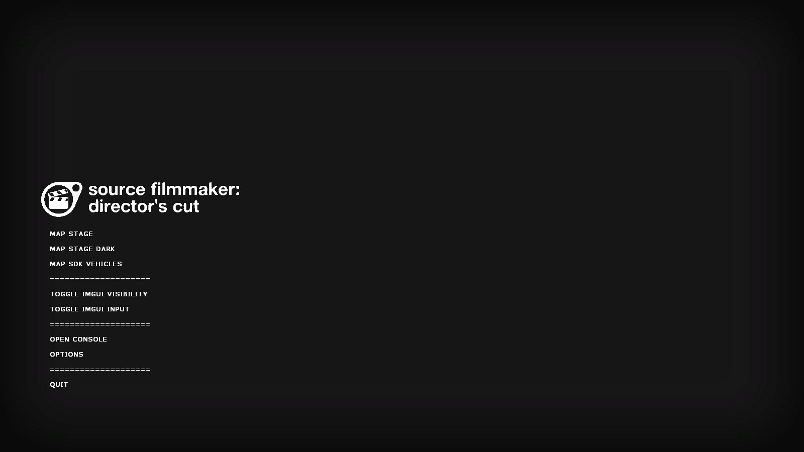
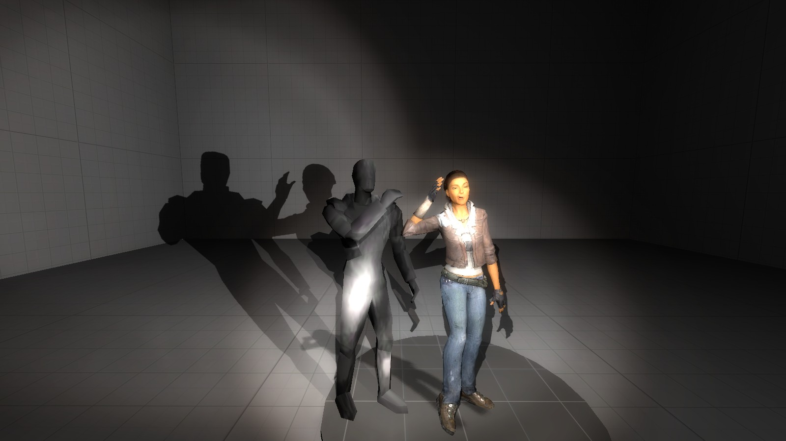
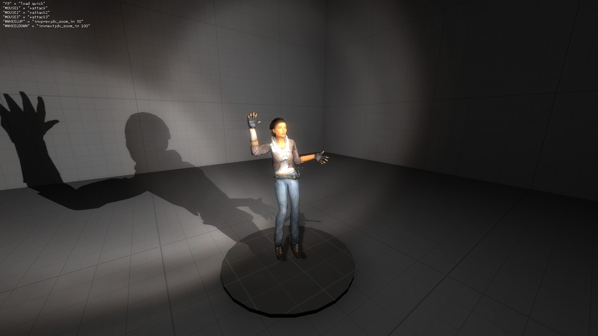

# Director's Cut

Rebuilding the Source Filmmaker from scratch. By the community, for the community.

## Links

- [GitHub](https://github.com/teampopplio/directorscut)
- [Twitter](https://twitter.com/SFMDirectorsCut)
- [Discord](discord.gg/3X3teNecWs)

## Installation

1. Install [Source SDK 2013 Singleplayer](steam://install/243730) through Steam.

1. Set the beta branch to `upcoming` through properties for Source SDK 2013 Singleplayer.

1. Download the [Mapbase v6.3](https://www.moddb.com/mods/mapbase/downloads/mapbase-release-build) release.

1. Extract the folders into your `sourcemods` directory.
    - This can usually be found in `C:\Program Files (x86)\Steam\steamapps\sourcemods`.

1. Download the latest [Director's Cut release](https://github.com/TeamPopplio/directorscut/releases).

1. Extract `directorscut` into your `sourcemods` directory.

1. Restart Steam and run the game as "Director's Cut".

## Usage

1. Load a map in the main menu.
    - You can also click "Open Console" to open the console and type `map <mapname>`.

1. Click "Toggle ImGUI Visibility" and "Toggle ImGUI Input" in the pause menu until the UI is interactable.
    - You can also press F1 and F2 respectively to toggle these in-game.

1. Use the top slider in the "Elements" menu to select the type of object to spawn.

1. Click "Spawn [Model / Light / Camera]" to spawn an object.
    - Alternatively, click "Spawn [Model / Light / Camera] at Pivot" to spawn an object at the current pivot point.

1. Use the transform gizmo to move or rotate the object.

1. If the object is a model, click "Make Physical" to create physics objects.
    - This is currently required for some bones to be manipulated.

1. Use the "Physics Object Index" slider to select a physics object to transform.
    - Alternatively, hold CTRL to select the physics object under the cursor as long as the index is above `-1`.

1. Press F or click "Freeze Physics Object" to freeze the physics object in place.

1. Press Z or click "Selected Physics Object to Pivot" to move the camera's pivot to the selected physics object.

1. Click "Remove Model" to delete the model.

1. You can scroll in/out to zoom the viewport camera, alongside using middle mouse to orbit the viewport.

1. Press F2 to toggle the UI and press F5 to save a screenshot. You've just made a poster!

## Controls

- Q: Selected object to pivot
- Z: Selected bone to pivot
- T: Translate mode
- R: Rotate mode
- Y: Universal mode
- L: Toggle local/world space
- F: Toggle frozen bone
- Mouse Wheel: Zoom viewport
- Middle Mouse: Orbit viewport
- F1: Toggle UI input
- F2: Toggle UI visibility
- F5: Write JPEG screenshot
- CTRL: While held, select objects by clicking on them
- See UI for more controls

## Building

1. Use the Visual Studio command prompt to execute these commands:

```batch
git clone https://github.com/TeamPopplio/directorscut.git
.\directorscut\sp\src\createdirectorscut.bat
git clone https://github.com/TeamPopplio/ImGui-CMake-Installer-v1.88.git
cd ImGui-CMake-Installer-v1.88
git checkout vs2013
mkdir build
cd build
cmake .. -G "Visual Studio 12 2013" -A Win32 -DIMGUI_STATIC_LIBRARY=OFF -DIMGUI_IMPL_DX9=ON
cmake --build . --config Release
mklink /J "C:\Program Files (x86)\Steam\steamapps\sourcemods\directorscut" ..\..\..\directorscut\sp\game\directorscut
```

1. Copy `ImGui-CMake-Installer-v1.88\vs2013\build\bin\Release\imgui.dll` to the `directorscut\sp\game\directorscut\bin` folder.

1. Download the [Mapbase v6.3](https://www.moddb.com/mods/mapbase/downloads/mapbase-release-build) release.

1. Place the Mapbase folders in your `sourcemods` folder.
    - This can usually be found in `C:\Program Files (x86)\Steam\steamapps\sourcemods`.

1. Copy `discord-rpc.dll` from the Mapbase release to the `directorscut\sp\game\directorscut\bin` folder.

1. Copy `game_shader_dx9.dll` from the Mapbase release to the `directorscut\sp\game\directorscut\bin` folder.

1. Open `directorscut\sp\src\directorscut.sln` in Visual Studio.

1. Build the project, restart Steam, and run the game.

## Screenshots

### v0.1.3


### v0.1.2



### v0.1.1



### v0.1.0



## References

- [ImGuizmo](https://github.com/CedricGuillemet/ImGuizmo)
- [Dear Imgui](https://github.com/ocornut/imgui)
- [Mapbase](https://github.com/mapbase-source/source-sdk-2013)
- [Source SDK 2013](https://github.com/ValveSoftware/source-sdk-2013)

## Licenses

### Source SDK 2013

```text
               SOURCE 1 SDK LICENSE

Source SDK Copyright(c) Valve Corp.  

THIS DOCUMENT DESCRIBES A CONTRACT BETWEEN YOU AND VALVE 
CORPORATION ("Valve").  PLEASE READ IT BEFORE DOWNLOADING OR USING 
THE SOURCE ENGINE SDK ("SDK"). BY DOWNLOADING AND/OR USING THE 
SOURCE ENGINE SDK YOU ACCEPT THIS LICENSE. IF YOU DO NOT AGREE TO 
THE TERMS OF THIS LICENSE PLEASE DON�T DOWNLOAD OR USE THE SDK.  

  You may, free of charge, download and use the SDK to develop a modified Valve game 
running on the Source engine.  You may distribute your modified Valve game in source and 
object code form, but only for free. Terms of use for Valve games are found in the Steam 
Subscriber Agreement located here: http://store.steampowered.com/subscriber_agreement/ 

  You may copy, modify, and distribute the SDK and any modifications you make to the 
SDK in source and object code form, but only for free.  Any distribution of this SDK must 
include this LICENSE file and thirdpartylegalnotices.txt.  
 
  Any distribution of the SDK or a substantial portion of the SDK must include the above 
copyright notice and the following: 

    DISCLAIMER OF WARRANTIES.  THE SOURCE SDK AND ANY 
    OTHER MATERIAL DOWNLOADED BY LICENSEE IS PROVIDED 
    "AS IS".  VALVE AND ITS SUPPLIERS DISCLAIM ALL 
    WARRANTIES WITH RESPECT TO THE SDK, EITHER EXPRESS 
    OR IMPLIED, INCLUDING, BUT NOT LIMITED TO, IMPLIED 
    WARRANTIES OF MERCHANTABILITY, NON-INFRINGEMENT, 
    TITLE AND FITNESS FOR A PARTICULAR PURPOSE.  

    LIMITATION OF LIABILITY.  IN NO EVENT SHALL VALVE OR 
    ITS SUPPLIERS BE LIABLE FOR ANY SPECIAL, INCIDENTAL, 
    INDIRECT, OR CONSEQUENTIAL DAMAGES WHATSOEVER 
    (INCLUDING, WITHOUT LIMITATION, DAMAGES FOR LOSS OF 
    BUSINESS PROFITS, BUSINESS INTERRUPTION, LOSS OF 
    BUSINESS INFORMATION, OR ANY OTHER PECUNIARY LOSS) 
    ARISING OUT OF THE USE OF OR INABILITY TO USE THE 
    ENGINE AND/OR THE SDK, EVEN IF VALVE HAS BEEN 
    ADVISED OF THE POSSIBILITY OF SUCH DAMAGES.  
 
       
If you would like to use the SDK for a commercial purpose, please contact Valve at 
sourceengine@valvesoftware.com.
```

### Dear Imgui

```text
The MIT License (MIT)

Copyright (c) 2014-2022 Omar Cornut

Permission is hereby granted, free of charge, to any person obtaining a copy
of this software and associated documentation files (the "Software"), to deal
in the Software without restriction, including without limitation the rights
to use, copy, modify, merge, publish, distribute, sublicense, and/or sell
copies of the Software, and to permit persons to whom the Software is
furnished to do so, subject to the following conditions:

The above copyright notice and this permission notice shall be included in all
copies or substantial portions of the Software.

THE SOFTWARE IS PROVIDED "AS IS", WITHOUT WARRANTY OF ANY KIND, EXPRESS OR
IMPLIED, INCLUDING BUT NOT LIMITED TO THE WARRANTIES OF MERCHANTABILITY,
FITNESS FOR A PARTICULAR PURPOSE AND NONINFRINGEMENT. IN NO EVENT SHALL THE
AUTHORS OR COPYRIGHT HOLDERS BE LIABLE FOR ANY CLAIM, DAMAGES OR OTHER
LIABILITY, WHETHER IN AN ACTION OF CONTRACT, TORT OR OTHERWISE, ARISING FROM,
OUT OF OR IN CONNECTION WITH THE SOFTWARE OR THE USE OR OTHER DEALINGS IN THE
SOFTWARE.
```

### ImGuizmo

```text
The MIT License (MIT)

Copyright (c) 2016 Cedric Guillemet

Permission is hereby granted, free of charge, to any person obtaining a copy
of this software and associated documentation files (the "Software"), to deal
in the Software without restriction, including without limitation the rights
to use, copy, modify, merge, publish, distribute, sublicense, and/or sell
copies of the Software, and to permit persons to whom the Software is
furnished to do so, subject to the following conditions:

The above copyright notice and this permission notice shall be included in all
copies or substantial portions of the Software.

THE SOFTWARE IS PROVIDED "AS IS", WITHOUT WARRANTY OF ANY KIND, EXPRESS OR
IMPLIED, INCLUDING BUT NOT LIMITED TO THE WARRANTIES OF MERCHANTABILITY,
FITNESS FOR A PARTICULAR PURPOSE AND NONINFRINGEMENT. IN NO EVENT SHALL THE
AUTHORS OR COPYRIGHT HOLDERS BE LIABLE FOR ANY CLAIM, DAMAGES OR OTHER
LIABILITY, WHETHER IN AN ACTION OF CONTRACT, TORT OR OTHERWISE, ARISING FROM,
OUT OF OR IN CONNECTION WITH THE SOFTWARE OR THE USE OR OTHER DEALINGS IN THE
SOFTWARE.
```
